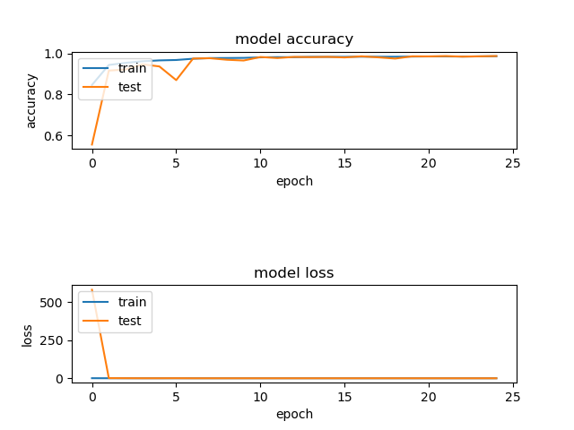
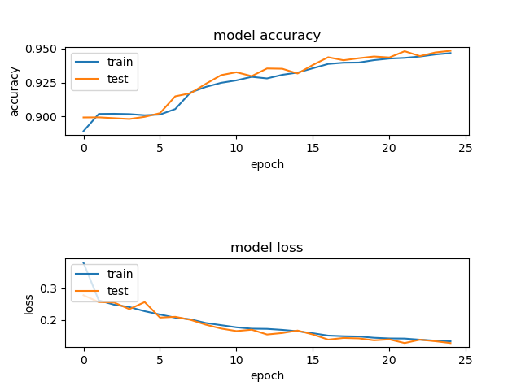
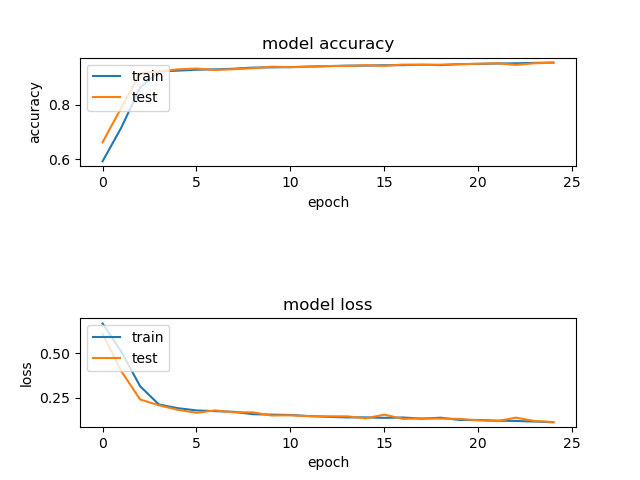
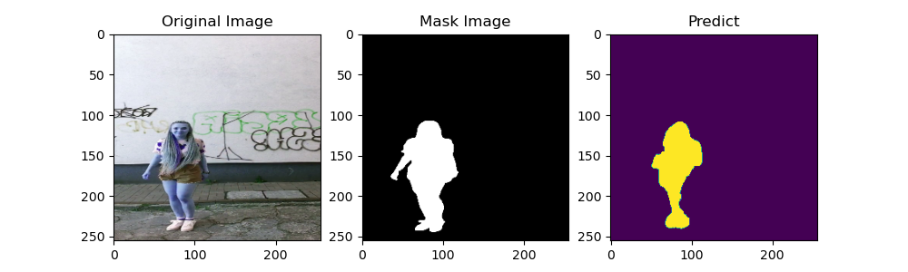
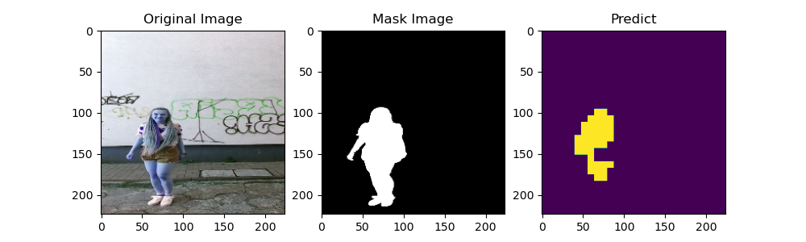

# 여러가지 모델을 이용한 Segmentaion 성능 비교.

## data download link
https://www.kaggle.com/tapakah68/segmentation-full-body-tiktok-dancing-dataset

## vgg16 사전 학습모델 download link
https://drive.google.com/file/d/1isYSonaX_Bf1YFDTjMvKAynkZ09BfKEc/view?usp=sharing

## 목적
- 여러가지 Segmentaion 모델을 이용해 카메라 촬영상의 사람 영역을 표시하고 각 모델간의 성능을 비교.

## Model Evaluate
</a>
- ResUnet
</a>
- Unet
</a>
- Vgg16_FCN

## Result
- ResUnet
</a>
- Unet
</a>
- Vgg16_FCN
</a>

- Vgg16은 coarse한 영역을 줄이기 위해 이전 feature map의 정보를 더하는 방법을 사용하였지만, Unet과 ResUnet에 비하면 성능이 매우 떨어졌다.
- 추후 Unet과 ResUnet의 성능을 더 자세히 비교하고 어느것이 Segmentaion에 적합한 모델인지에 대한 실험을 진행 할 것이다.

